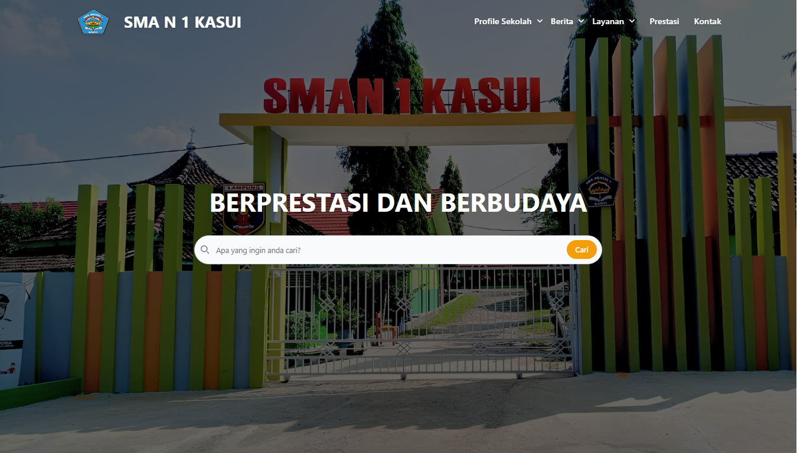
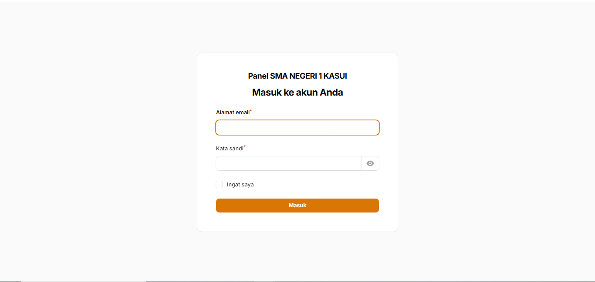
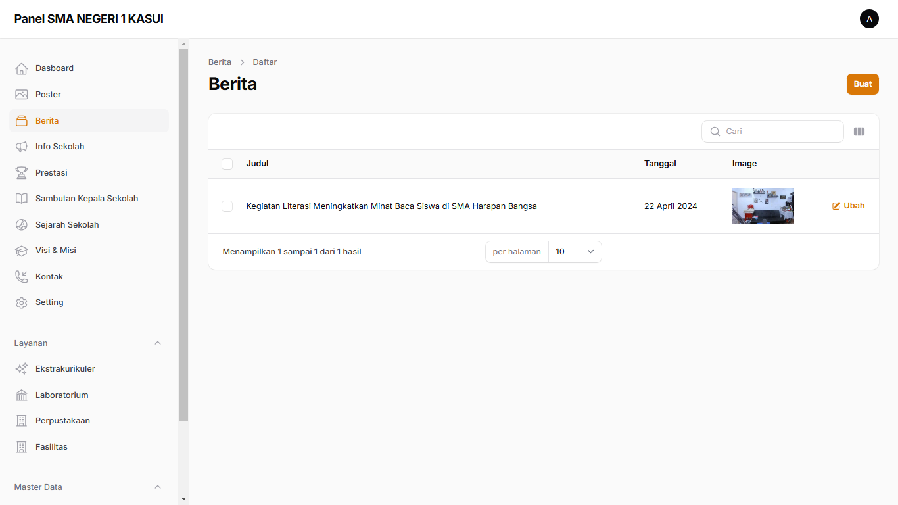
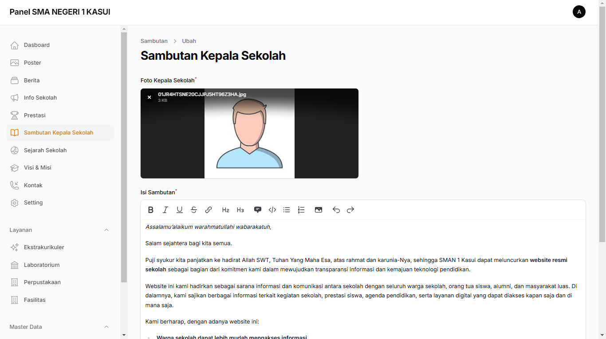

# 🌐 Website Sekolah & Dashboard Admin

Ini adalah proyek website sekolah yang dibangun dari awal menggunakan **Tailwind CSS** untuk tampilan frontend dan **Laravel Filament** untuk dashboard admin yang powerful.

## ✨ Fitur Unggulan

### Website Sekolah (Frontend)

-   Desain modern dan responsif dengan **Tailwind CSS**
-   Halaman Home, Tentang, Berita, Info Sekolah, Layanan, dan Kontak
-   Struktur HTML yang semantik dan rapi
-   Navigasi mudah dan cepat

### Dashboard Admin (Backend)

-   Dibangun dengan **Laravel + Filament**
-   CRUD Dinamis untuk mengelola:
    -   Berita Sekolah
    -   Info Sekolah
    -   Profil Sekolah
    -   dll
-   Otentikasi Admin bawaan dari Filament
-   UI admin modern dan siap pakai

## 🛠️ Teknologi yang Digunakan

-   [Tailwind CSS](https://tailwindcss.com/)
-   [Laravel](https://laravel.com/)
-   [Filament Admin](https://filamentphp.com/)
-   PHP, HTML, Blade, dan Alpine.js

## 🚀 Cara Menjalankan Proyek Ini

### 1. Clone repositori

```bash
git clone https://github.com/ilhanmanzis/websekolah.git
cd websekolah
```

### 2. Install dependensi Laravel

```
composer install
npm install
```

### 3. Buat file .env dan konfigurasi database

```
cp .env.example .env
php artisan key:generate
```

### 4. Setup database dan migrasi

```
php artisan migrate --seed
```

### 5. Jalankan server Laravel

```
php artisan serve
```

### Buat user admin

```
php artisan make:filament-user
```

## 📸 Screenshot





